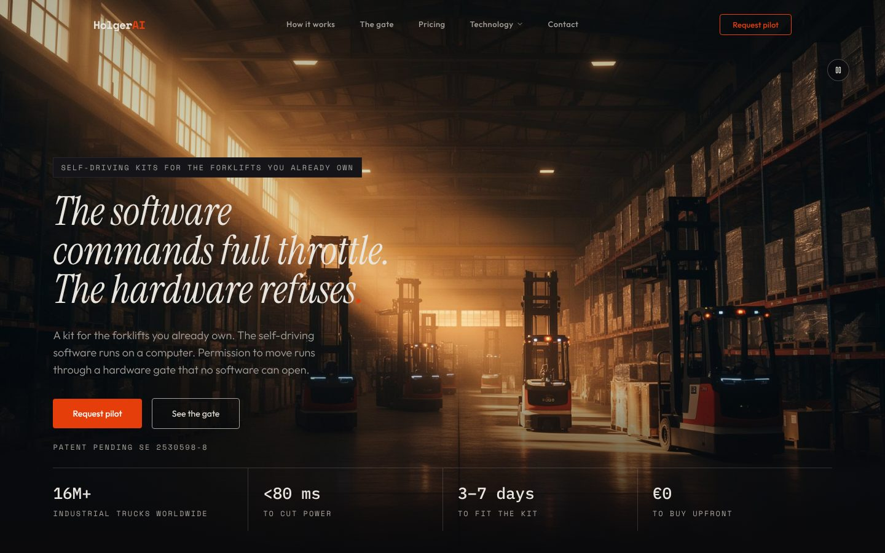

### Farre

Stockholm. I build AI agents, retrieval systems and the websites around them, and I run them in production on my own hardware. Founder of [HolgerAI](https://holgerai.com).

---

#### HolgerAI · retrofit autonomy for forklifts

HolgerAI is a Swedish deep tech company. It is building a kit, with its own hardware, designed to make the forklifts a warehouse already owns drive themselves. The software can ask for full throttle, but permission to move runs through a hardware gate that no software can open. Swedish patent application SE 2530598-8 (2025) and PCT application (2026). I designed and built the site.

#### hub-minne · local RAG memory for an agent platform

Retrieval layer for Holger Hub, the platform where my agents (Claude Code, Codex, OpenClaw, Hermes) run around the clock. TypeScript, Mastra, Express and PostgreSQL with pgvector. Hybrid search (vectors plus Postgres full text, fused with Reciprocal Rank Fusion), source weighting, and a Mastra agent answering with citations from a local Qwen model. Nothing leaves the machine.

Measured on a question set with known answers, the share of questions with the right fact in the top 5 went from 45 % with plain vector search to 77 %.

Code: [github.com/farrebutterfly-rgb/hub-minne](https://github.com/farrebutterfly-rgb/hub-minne)

#### Products on top of the platform

- **[Relta](https://relta.app)** · AI accounting bureau for Swedish companies. Built so that agents do the bookkeeping and an authorized accountant reviews and signs off. Deployed on Vercel and Neon with Stripe, BankID and bank connection. A PKI certificate from Expisoft ties the organisation e-ID to the company registration number.
- **[Lexra](https://lexra.se)** · AI-driven law firm. Built so that agents draft and review and a licensed lawyer signs. Contract review scored 87 % recall and 100 % precision on our own test set.
- **[Wattvik](https://wattvik.com)** · co-founder. Monitoring of electronic component shortages and sourcing for B2B buyers.

#### Also

- **Regla**, a concept for automating paperwork in Swedish civil construction: design system in Figma (variables, 14 text styles, mobile and web screens) and a pitch deck with CAD-style drawings.

---

**Stack** · TypeScript, Node.js, Express, Python, React, Next.js, PostgreSQL, pgvector, Mastra, Claude API, OpenAI, local models via LM Studio, Lovable, Vercel, Figma

**Languages** · Swedish and English (native), Tigrinya and Arabic (B2)

farre@holgerai.com
