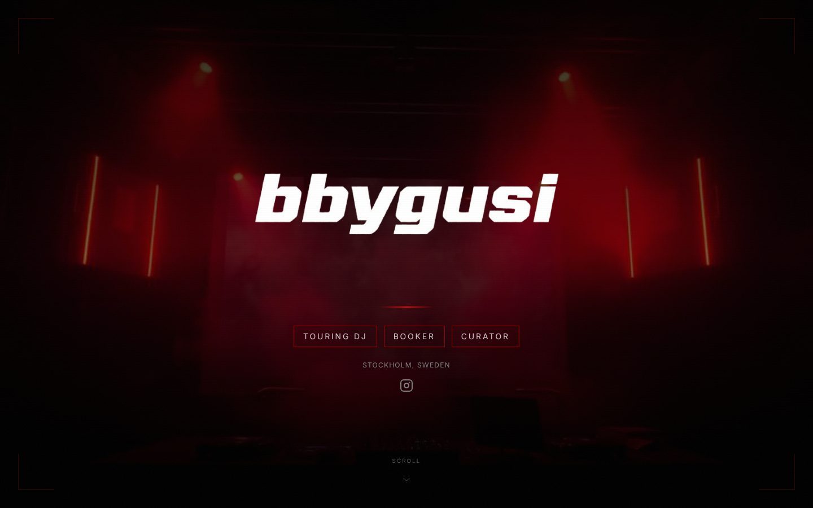

### Farre

Stockholm. I build AI agents, retrieval systems and the websites around them, and I run them in production on my own hardware. Founder of [HolgerAI](https://holgerai.com). By day, Lead Material Handler in GMP-regulated manufacturing at Cepheid, which is where the idea for HolgerAI came from.

---

#### HolgerAI · retrofit autonomy for forklifts

A kit that makes the forklifts a warehouse already owns drive themselves. The software can ask for full throttle, but permission to move runs through a hardware gate that no software can open. Swedish patent application SE 2530598-8 (2025) and PCT application (2026). I designed and built the site.

#### hub-minne · local RAG memory for an agent platform

Retrieval layer for Holger Hub, the platform where my agents (Claude Code, Codex, OpenClaw, Hermes) run around the clock. TypeScript, Mastra, Express and PostgreSQL with pgvector. Hybrid search (vectors plus Postgres full text, fused with Reciprocal Rank Fusion), source weighting, and a Mastra agent answering with citations from a local Qwen model. Nothing leaves the machine.

Measured on a question set with known answers, the share of questions with the right fact in the top 5 went from 45 % with plain vector search to 77 %.

→ [github.com/farrebutterfly-rgb/hub-minne](https://github.com/farrebutterfly-rgb/hub-minne)

#### bbygusi.com · site for a touring DJ and booker

Client work. Art direction, dark stage-light look, and a mobile-first rebuild with lighter video so it loads fast on a phone at the venue. Built in Lovable and React.

#### Also

- **Press kits** for the DJs bbygusi and diegoxmami: one-pager, rider with stage plot, bios in Swedish and English, logo files, print-locked to A4.
- **Regla**, a concept for automating paperwork in Swedish civil construction: design system in Figma (variables, 14 text styles, mobile and web screens) and a pitch deck with CAD-style drawings.
- **6FEMNOLL**, co-founder. A Stockholm club concept with thousands of visitors: event production, partnerships, funding, video walls and brand loops.

---

**Stack** · TypeScript, Node.js, Express, Python, React, Next.js, PostgreSQL, pgvector, Mastra, Claude API, OpenAI, local models via LM Studio, Lovable, Vercel, Figma

**Languages** · Swedish, English and Tigrinya (native), Arabic

farre@holgerai.com
